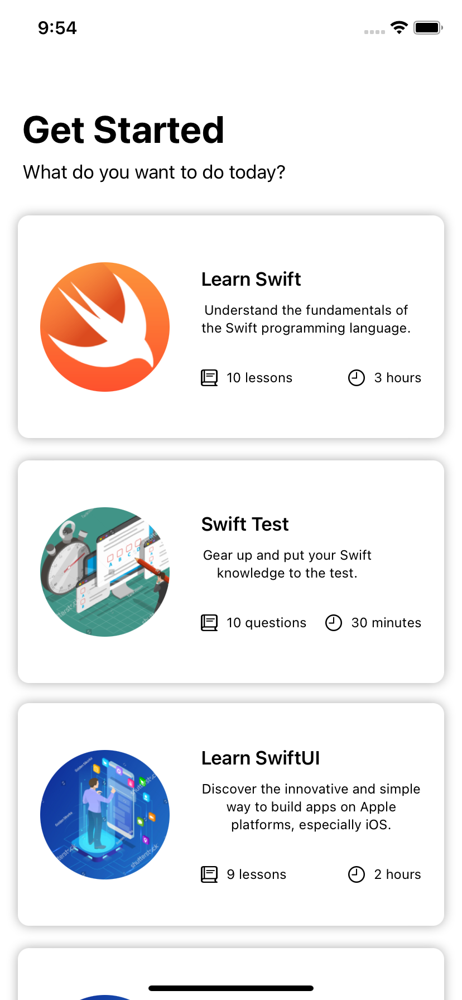
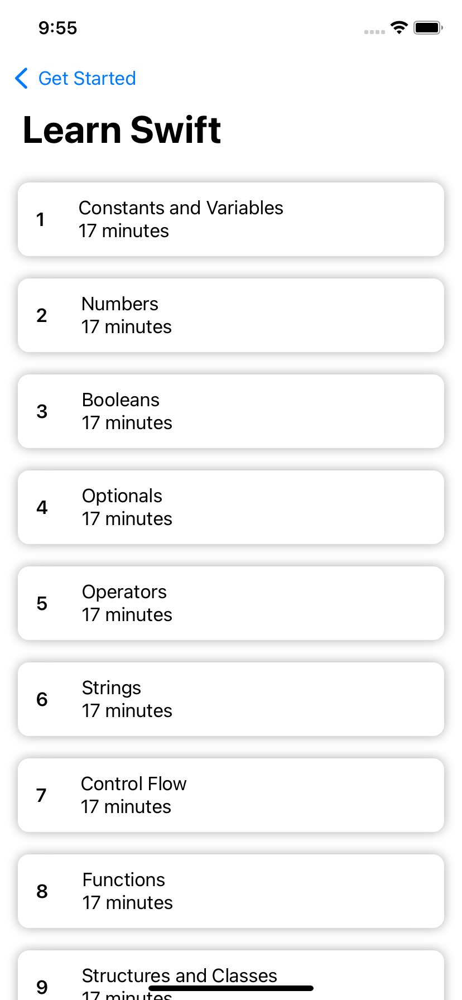
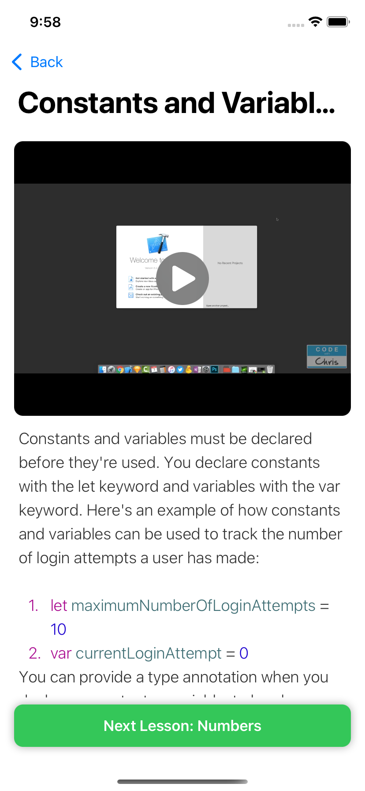
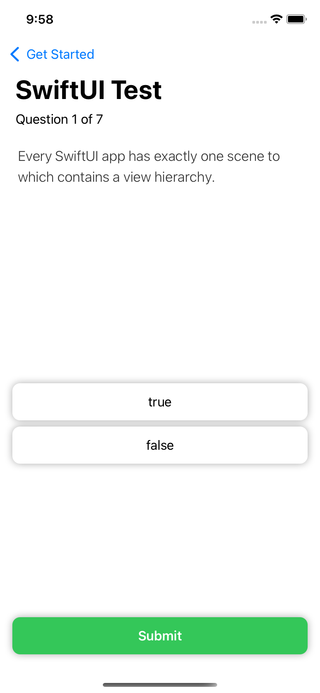
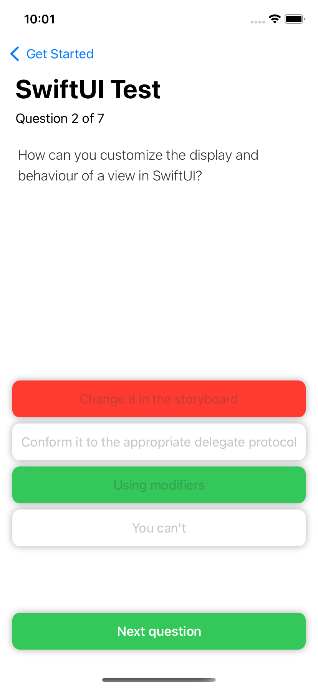
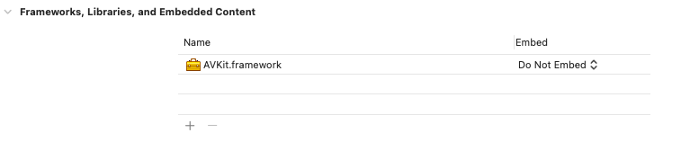

# Learning App
Displays how to make a learning app with Swift, iOS's programming language. Based on module five in the fantastic codewithchris.com iOS Foundations course.

## App Features
- Dynamic screens that track state throughout app with `EnvironmentObject`
- Parses JSON data
- Displays HTML + CSS styled text as an `NSAttributedString`
- Fetches JSON data from a website
- Displays videos from external websites within the app
- Grades students for right answers defined in the JSON configuration file

## Design
### HomeView
This view displays a list of learning modules. Each learning module contains a learning and test component. 
The learning component contains a list of lessons with a video for each lesson as well as formatted
HTML/ CSS text. The test component, instead contains a list of test questions.



### ContentView
The ContentView displays the list of lessons. 


### ContentDetailView
This displays the lesson detail as well as a video, and specially formatted text in a ScrollView. 
The user can go to the next lesson with the button at the bottom. It will also pop the user back to
the HomeView, if there are no more lessons left.



### TestView
This displays a single multiple choice question. The screen will show in green, or red, once the 
user submits his or her answer to the question.



### TestResultView
This displays the results of the quiz. It will display three types of text, depending on the score
the student earned during the quiz.


## Special Styling
The JSON data combines styles from HTML/ CSS into something useable in iOS/ Swift. From [Module 
5 Lesson 3 of Code with Chris](https://learn.codewithchris.com/courses/take/foundations/lessons/22274485-lesson-3-parsing-the-json-data)

## Videos
You can use the AVKit to show a video player for different lessons. First, you must click the project settings (blue icon
top left), then you scroll down to frameworks -> click the plus button, and search for AVKit. Then you import `AVKit`, at the top of the SwiftUI file you want to include your information.


Code to include video within app with an external link:
```
let url = ``

// Expects a AVPlayer object with a URL object
VideoPlayer(player: AVPlayer(url: <#T##URL#>))
```

### Video Hosting Options
You can link to the videos on GitHub (after converting the repo to a GitHub pages project), Vimeo, or another publicly accessible streaming platform that allows for the direct download of the `.mp4` file.

## Displaying UIKit Elements in SwiftUI
We can use the UIViewRepresentable protocol to display UIKit elements within SwiftUI views.
